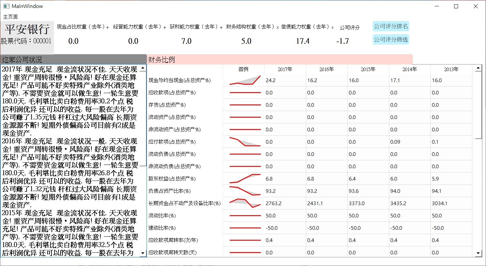
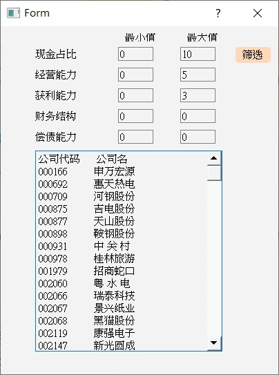
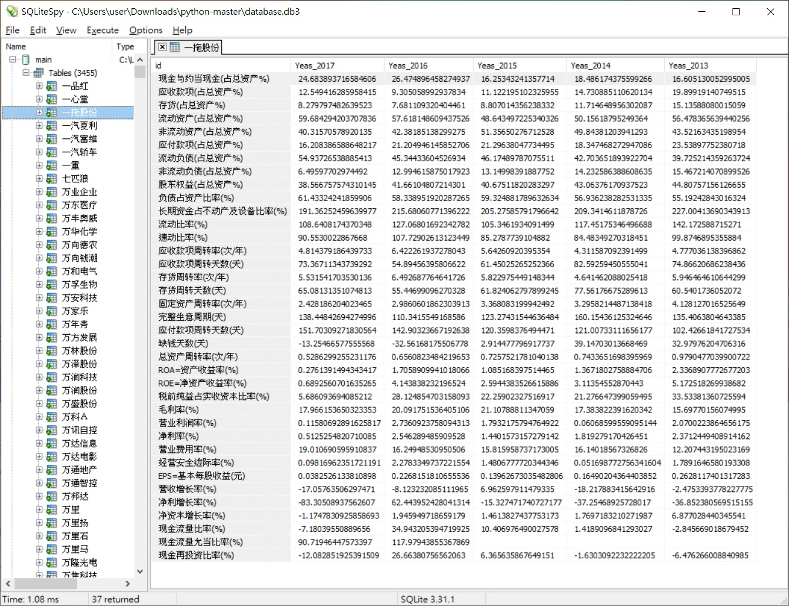
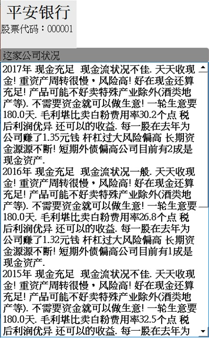
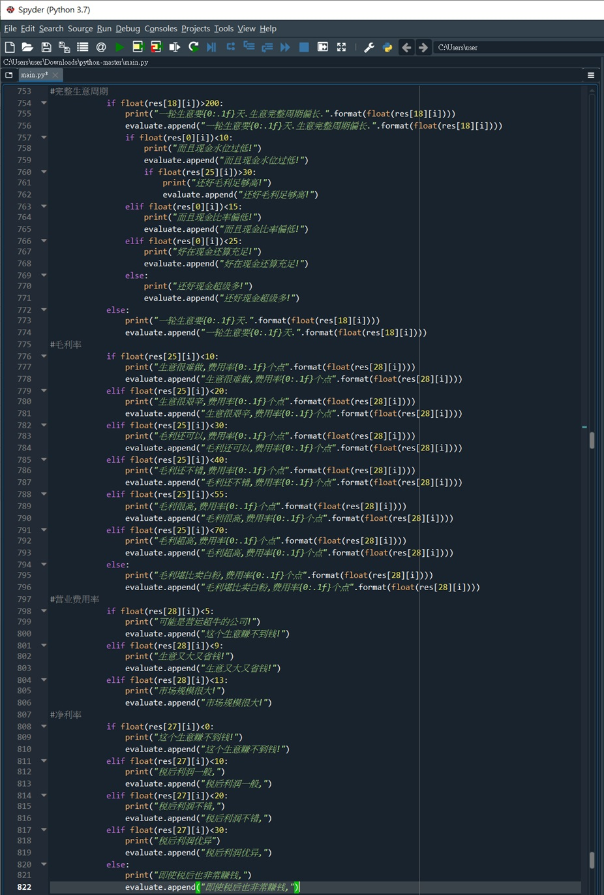
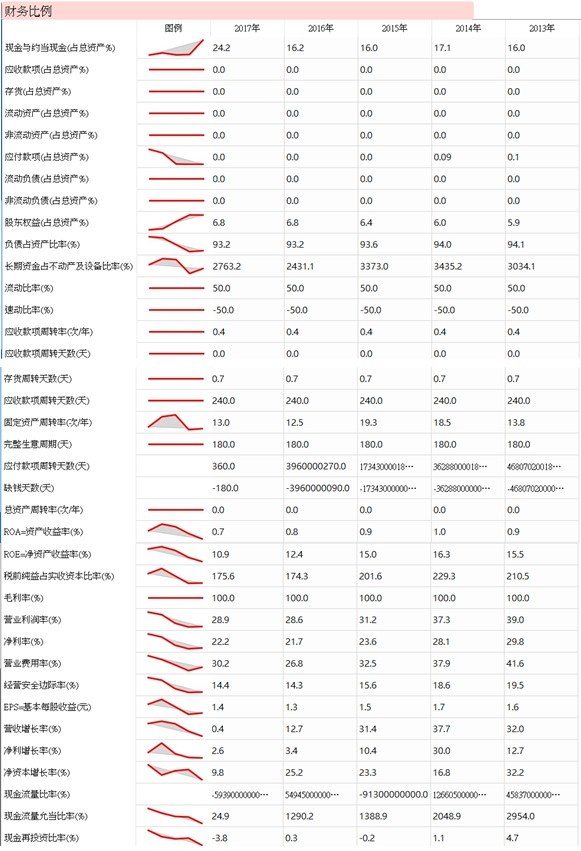

## Financial Analysis System for PRC Listed Companies by Python

## Preface

Big data is a popular new catchphrase in the realm of information technology and quantitative methods that refer to the collection and analysis of massive amounts of information. Advances in computing power along with falling prices thereof are making big data projects increasingly more technically feasible and economic. In particular, the advent of cloud computing is putting the cost of big data analysis within the reach of many smaller firms, which now do not need to make significant capital investments in their own computing infrastructure.

As the accounting/financial industry has rapidly sprung up towards data-driven optimization in response to the growth of big data, companies must respond to these changes in a deliberate and comprehensive manner. Efficient technology solutions that meet the advanced analytical demands of digital transformation will enable the companies to fully leverage the capabilities of unstructured and high volume data, discover competitive advantages, and drive new market opportunities.

Moreover, it is of great help to my professional development. Hence, I created a financial analysis system for PRC listed companies by Python. It may also help investors formulate better investment strategies. If you are interested in it, please read the following information:

## Purpose

Applying Python to establish a financial analysis system for PRC listed companies.

## System Outcome

1. Search Page (start.py)

2. Main Window (main.py)

3. Ranking of Company Rating (rank.py)

4. Selection of Company (selectfirm.py)

## Project Procedure

• System Development Environment:  
a. Integrated development environment: Anaconda  
b. Programming language: Python 3.7  
c. Database: SQLite3  
d. UI graphics library: PyQt5  
e. Other libraries: Matplotlib, Numpy

• Description of Related Technology  
I used the SQLite database, the front end UI PyQt5 image library and the preliminary UI interface design tool through Qt Designer.

• Database Establishment  
For database, I used SQLiteSpy as it was easy to use and did not require any complicated configuration for its installation. I imported the csv tables of each company's financial data calculated before into the database, please refer to createdatabase.py.

After that, I used Qt Designer to preliminarily design the search page, and then further refined the platform to get start.py.

The files start.py, main.py, rank.py, selectfirm.py, etc. corresponded to the respective pages, and the financial comments referred to the website caibaoshuo.com (财报说). For example, the financial performance of the sample company Ping An Bank is as follows:

The evaluation was generated by the automatic judgment of various data machines.

But how to insert the legend of the data change trend in the table?

This data came from main.py. I applied Matplotlib to generate pictures, and then inserted Form Controls into the table.

If you are interested in the details, please take a look at my Python codes, which have been uploaded to github: https://github.com/wcfjeffrey/Python
