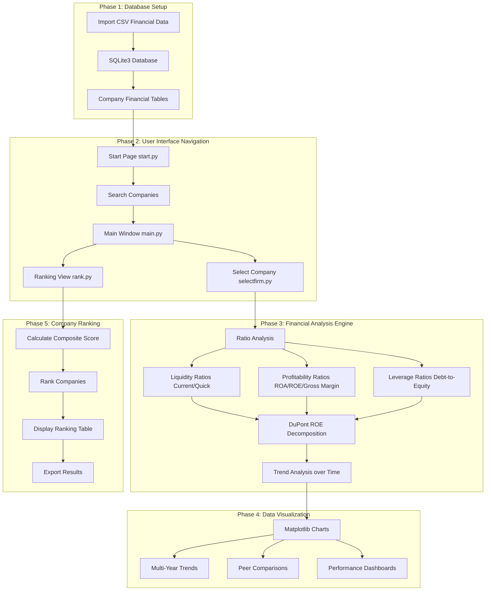

## Financial Analysis System (for PRC Listed Companies by Python)

## 📝 Preface

"Big data" has evolved from a catchphrase into the driving force behind modern financial intelligence. Advances in computing power and the advent of cloud computing have democratized data analysis, putting sophisticated insights within reach of firms of all sizes. In response, the accounting and finance industry is rapidly shifting toward data-driven optimization. Companies that leverage efficient technology solutions to analyze both structured and high-volume unstructured data can unlock competitive advantages and discover new market opportunities.

This project represents the starting point of my personal and professional journey into data-driven financial analysis. It serves as the logical and technical foundation for all my subsequent AI-powered financial applications, including advanced valuation models and risk simulations.

More than just a technical exercise, this system demonstrates how to transform enduring financial theories—including DCF (Discounted Cash Flow), DuPont Analysis, and Capital Structure Theory—into practical, executable analytical tools. Although technology stacks evolve (from this Python-based desktop application to modern web and AI integrations), the core analytical framework, valuation logic, and risk assessment mindset established here remain central to my financial work today. I regard this project as a "living methodological document," showcasing my mastery of financial fundamentals and my ability to systematize and engineer complex theories into scalable solutions.

By creating this analysis system for PRC listed companies using Python, I aimed to deepen my own expertise and build a tool that could also help investors formulate better, data-backed investment strategies.

If you are interested in it, please read the following information:

## 🎯 Purpose

Applying Python to establish a financial analysis system for PRC listed companies.

## 🤖 Tech Stack

- **Language** — Python 3.7, Jupyter Notebook  
- **Database** — SQLite3 (lightweight relational database for storing company financials)  
- **UI** — PyQt5 (desktop GUI, designed with Qt Designer)  
- **Visualization** — Matplotlib (charts, trend graphs), NumPy (numerical computations)  
- **Environment** — Anaconda  
- **Data Sources** — CSV imports of PRC-listed company financials, integrated into SQLite

## 💰 Financial Analysis Theories Applied

This system applies not just technical coding but also embeds core financial analysis theories—ratio analysis, DuPont decomposition, valuation models, and risk frameworks for professional finance/accounting:
- **Ratio Analysis Frameworks** — 
The app calculates liquidity (current ratio, quick ratio), profitability (ROA, ROE, gross margin), and leverage (debt-to-equity) ratios, directly aligning with textbook financial statement analysis.  
- **DuPont Analysis** — 
Integrated into ranking dashboards, ROE is decomposed into net profit margin, asset turnover, and equity multiplier, helping users identify the drivers of shareholder value.  
- **Trend & Comparative Analysis** — 
Using Matplotlib, the app visualizes multi-year trends and peer comparisons, reflecting horizontal and vertical analysis methods taught in accounting and finance.  
- **Discounted Cash Flow (DCF) & Net Present Value (NPV)** — 
Forecasting modules apply time value of money principles to evaluate investment projects and corporate valuation, supporting investor decision-making.  
- **Capital Structure & Risk Theories** — 
Debt-to-equity and asset-liability ratios are embedded into dashboards, reflecting Modigliani-Miller and trade-off theory considerations for financing decisions.  
- **Variance & Sensitivity Analysis** — 
Stochastic simulations test resilience of financial outcomes under different market conditions, aligning with actuarial-style stress testing and modern risk management.  
- **Corporate Governance & Compliance** — 
By modeling PRC-listed companies, the app implicitly applies controlled foreign corporation (CFC) regime awareness and compliance frameworks, ensuring group structures and intercompany transactions are correctly represented.

## 📈 System Outcome

1. Search Page (start.py)

2. Main Window (main.py)

3. Ranking of Company Rating (rank.py)

4. Selection of Company (selectfirm.py)

## 🛠️ Project Procedure

• **System Development Environment:**  
a. Integrated development environment: Anaconda  
b. Programming language: Python 3.7  
c. Database: SQLite3  
d. UI graphics library: PyQt5  
e. Other libraries: Matplotlib, Numpy

• **Description of Related Technology**  
I used the SQLite database, the front end UI PyQt5 image library and the preliminary UI interface design tool through Qt Designer.

• **Database Establishment**  
For database, I used SQLiteSpy as it was easy to use and did not require any complicated configuration for its installation. I imported the csv tables of each company's financial data calculated before into the database, please refer to createdatabase.py.

After that, I used Qt Designer to preliminarily design the search page, and then further refined the platform to get start.py.

The files (start.py, main.py, rank.py, selectfirm.py, etc.) corresponded to their respective pages, and the financial commentary was obtained by web crawling the website [caibaoshuo.com](https://caibaoshuo.com/) (财报说). For example, the financial performance of the sample company Ping An Bank is as follows:

The evaluation was generated by the automatic judgment of various data machines.

But how to insert the legend of the data change trend in the table?

This data came from main.py. I applied Matplotlib to generate pictures, and then inserted Form Controls into the table.

## 📐Data Flow and Logic Sequence

The following diagram illustrates how the system processes financial data — from CSV import to SQLite storage, through ratio analysis and DuPont decomposition, to the PyQt5 dashboard and ranking outputs — integrating the financial theories and technical components described above.

> **Phases shown below:**
> 1. Database Setup (CSV → SQLite)
> 2. User Interface Navigation (PyQt5 pages)
> 3. Financial Analysis Engine (ratios, DuPont)
> 4. Data Visualization (Matplotlib charts)
> 5. Company Ranking (composite scoring)

```mermaid
flowchart TD
    subgraph PHASE1["Phase 1: Database Setup"]
        direction TB
        A1["Import CSV Financial Data"] --> A2["SQLite3 Database"]
        A2 --> A3["Company Financial Tables"]
    end

    subgraph PHASE2["Phase 2: User Interface Navigation"]
        direction TB
        B1["Start Page start.py"] --> B2["Search Companies"]
        B2 --> B3["Main Window main.py"]
        B3 --> B4["Select Company selectfirm.py"]
        B3 --> B5["Ranking View rank.py"]
    end

    subgraph PHASE3["Phase 3: Financial Analysis Engine"]
        direction TB
        C1["Ratio Analysis"] --> C2["Liquidity Ratios Current/Quick"]
        C1 --> C3["Profitability Ratios ROA/ROE/Gross Margin"]
        C1 --> C4["Leverage Ratios Debt-to-Equity"]
        C2 --> C5["DuPont ROE Decomposition"]
        C3 --> C5
        C4 --> C5
        C5 --> C6["Trend Analysis over Time"]
    end

    subgraph PHASE4["Phase 4: Data Visualization"]
        direction TB
        D1["Matplotlib Charts"] --> D2["Multi-Year Trends"]
        D1 --> D3["Peer Comparisons"]
        D1 --> D4["Performance Dashboards"]
    end

    subgraph PHASE5["Phase 5: Company Ranking"]
        direction TB
        E1["Calculate Composite Score"] --> E2["Rank Companies"]
        E2 --> E3["Display Ranking Table"]
        E3 --> E4["Export Results"]
    end

    A3 --> B1
    B4 --> C1
    B5 --> E1
    C6 --> D1
```

## ⭐ Finance Skills Strengthened
• Full‑stack architecture for financial analytics applications.  
• Advanced Python programming for financial system data integration.  
• Secure handling of financial datasets & environment variables.  
• AI‑powered financial modeling & variance analysis workflows.  
• File parsing & structured data transformation (CSV, PDF, SQL) for automated reporting.  
• Data visualization with Matplotlib & interactive dashboards for decision support.  
• Database management & financial analytics — contributing to professional growth in finance transformation & investment strategy.

## 📚 References

**1. Financial Theories & Valuation Models**

**Discounted Cash Flow (DCF) & Net Present Value (NPV) (time value of money principles for evaluating investment projects and corporate valuation in the forecasting modules)**

- [Brealey, R. A., Myers, S. C., & Allen, F. (2023). Principles of Corporate Finance (14th ed.). McGraw-Hill Education. (Original work published 1981)](https://www.mheducation.com/highered/product/principles-of-corporate-finance-brealey.html?viewOption=student)

**DuPont Analysis (ROE decomposition into net profit margin, asset turnover, and equity multiplier within the ranking dashboards)**

- [Foulke, R. A. (1968). Practical Financial Statement Analysis (6th ed.). McGraw-Hill. (Original work published 1945)](https://www.amazon.com/Practical-Financial-Statement-Analysism-6th/dp/007021655X)
  
**Capital Structure Theories (Modigliani-Miller & Trade-Off Theory) (Debt-to-equity and asset-liability ratio analysis embedded in dashboards, reflecting capital structure considerations)**

- [Modigliani, F., & Miller, M. H. (1958). The Cost of Capital, Corporation Finance and the Theory of Investment. The American Economic Review, 48(3), 261–297.](https://www.jstor.org/stable/1809766)
- [Modigliani, F., & Miller, M. H. (1963). Corporate Income Taxes and the Cost of Capital: A Correction. The American Economic Review, 53(3), 433–443.](https://www.jstor.org/stable/1809167)
- [Kraus, A., & Litzenberger, R. H. (1973). A State-Preference Model of Optimal Financial Leverage. The Journal of Finance, 28(4), 911–922.](https://www.jstor.org/stable/2978343)

**Ratio Analysis Framework (Liquidity (current/quick ratio), profitability (ROA, ROE, gross margin), and leverage (debt-to-equity) ratio calculations)**

- [Horrigan, J. O. (1968). A Short History of Financial Ratio Analysis. The Accounting Review, 43(2), 284–294.](https://www.jstor.org/stable/243765)

**2. Technical Libraries & Tools**

**PyQt5 (Desktop GUI designed with Qt Designer for search pages, main windows, and ranking displays)**

- [Riverbank Computing Limited. (2024). PyQt5: Python Bindings for Qt5 Application Framework.](https://www.riverbankcomputing.com/software/pyqt/)

**Matplotlib (Visualization for multi-year trends, peer comparisons, and performance dashboards)**

- [Hunter, J. D. (2007). Matplotlib: A 2D Graphics Environment. Computing in Science & Engineering, 9(3), 90–95.](https://doi.org/10.1109/MCSE.2007.55)

**NumPy (Numerical calculations supporting ratio analysis and stochastic simulations)**

- [Harris, C. R., Millman, K. J., van der Walt, S. J., et al. (2020). Array programming with NumPy. Nature, 585, 357–362.](https://doi.org/10.1038/s41586-020-2649-2)

**SQLite3 (Lightweight relational database storing company financial data imported from CSVs)**

- [Hipp, D. R. (2024). SQLite: The Most Deployed Database in the World. SQLite Consortium.](https://www.sqlite.org/)

**Anaconda (Integrated development environment managing Python 3.7 installation and libraries)**

- [Anaconda Software Distribution. (2024). Anaconda Distribution: The World's Most Popular Python Distribution for Data Science. Anaconda, Inc.](https://docs.anaconda.com/)

**Financial commentary (Web Crawling)**

- [财报说 (CaiBaoShuo). (2020). PRC Listed Company Financial Performance Commentary.](https://caibaoshuo.com/)

## ⚖️ Disclaimer
This app is for educational and portfolio demonstration purposes only. It does not provide financial, investment, or legal advice.

Data is sourced from public third‑party websites (e.g., 财报说) and may not be accurate or complete. The software is provided “as is” without warranties. Past performance does not guarantee future results.

Always consult a qualified professional before making investment decisions. The developer is not liable for any losses or damages arising from use of this system.

## 📄 License

**GNU Affero General Public License v3.0 (AGPL‑3.0)** — JeffreyWoo Financial Analysis System

- ✅ You are free to use, modify, and distribute this software, provided that any derivative works are also licensed under AGPL‑3.0.
- ✅ If you run or deploy this software over a network (e.g., as a web service), you must make the source code of your modified version available to all users who interact with it.
- ✅ This ensures transparency, collaboration, and continued open‑source availability of improvements.
- ❌ The software is provided “as is”, without warranties of any kind.

For full details, see the [LICENSE](./LICENSE) file.

## 👤 About the Author
Jeffrey Woo — Finance Manager | Strategic FP&A, AI Automation & Cost Optimization | MBA | FCCA | CTA | FTIHK | SAP Financial Accounting (FI) Certified Application Associate | Xero Advisor Certified

📧 Email: jeffreywoocf@gmail.com  
💼 LinkedIn: https://www.linkedin.com/in/wcfjeffrey/  
🐙 GitHub: https://github.com/wcfjeffrey/
