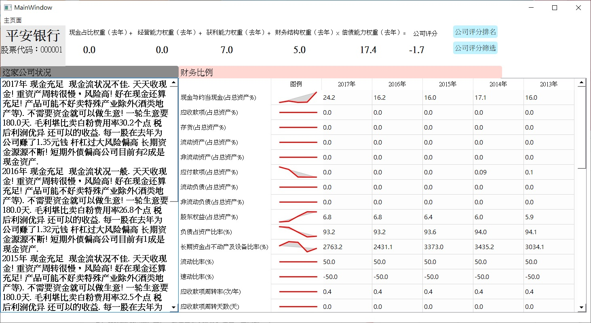
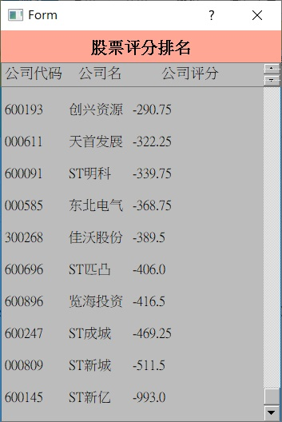
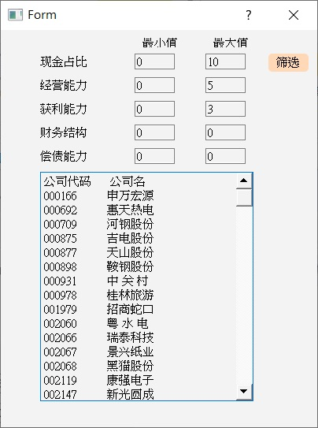
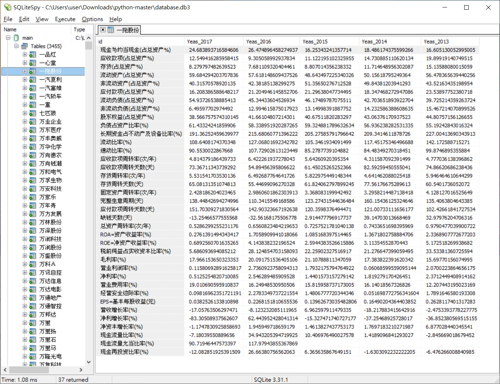
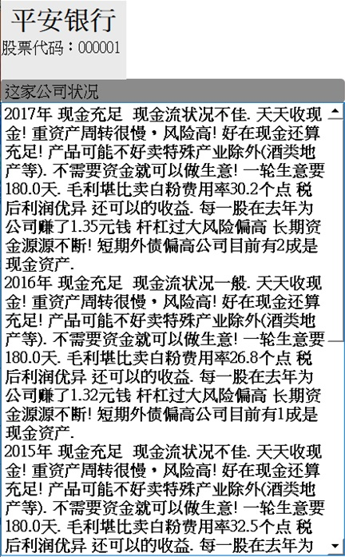
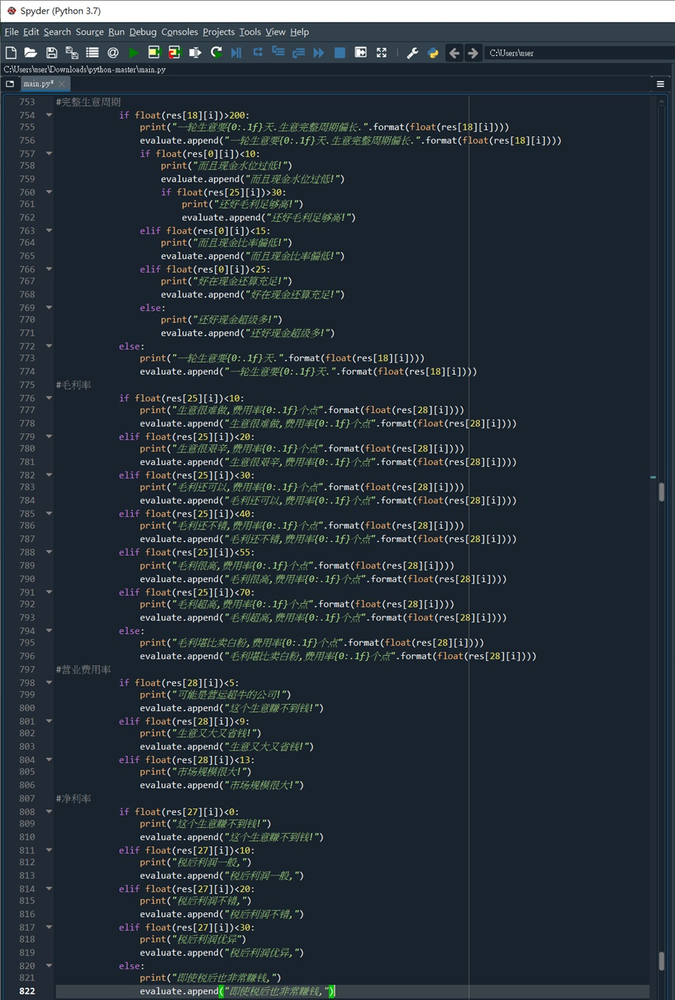
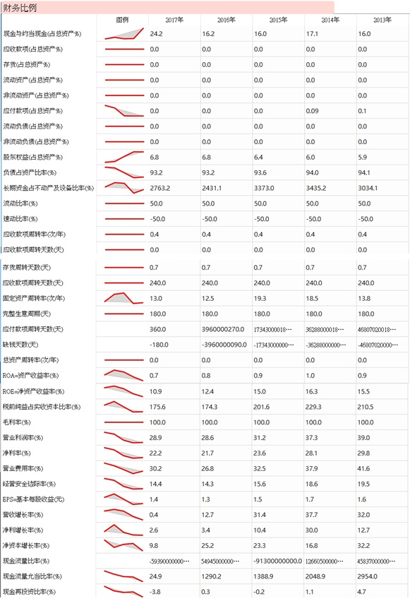

## Financial Analysis System (for PRC Listed Companies by Python)

## 📝 Preface

Big data is a popular new catchphrase in the realm of information technology and quantitative methods that refer to the collection and analysis of massive amounts of information. Advances in computing power along with falling prices thereof are making big data projects increasingly more technically feasible and economic. In particular, the advent of cloud computing is putting the cost of big data analysis within the reach of many smaller firms, which now do not need to make significant capital investments in their own computing infrastructure.

As the accounting/financial industry has rapidly sprung up towards data-driven optimization in response to the growth of big data, companies must respond to these changes in a deliberate and comprehensive manner. Efficient technology solutions that meet the advanced analytical demands of digital transformation will enable the companies to fully leverage the capabilities of unstructured and high volume data, discover competitive advantages, and drive new market opportunities.

Moreover, it is of great help to my professional development. Hence, I created a financial analysis system for PRC listed companies by Python. It may also help investors formulate better investment strategies. If you are interested in it, please read the following information:

## 🎯 Purpose

Applying Python to establish a financial analysis system for PRC listed companies.

## 🤖 Tech Stack

- **Language** — Python 3.7, Jupyter Notebook  
- **Database** — SQLite3 (lightweight relational database for storing company financials)  
- **UI** — PyQt5 (desktop GUI, designed with Qt Designer)  
- **Visualization** — Matplotlib (charts, trend graphs), NumPy (numerical computations)  
- **Environment** — Anaconda  
- **Data Sources** — CSV imports of PRC-listed company financials, integrated into SQLite

## 💰 Financial Analysis Theories Applied

This system applies not just technical coding but also embeds core financial analysis theories—ratio analysis, DuPont decomposition, valuation models, and risk frameworks for professional finance/accounting:
- **Ratio Analysis Frameworks** — 
The app calculates liquidity (current ratio, quick ratio), profitability (ROA, ROE, gross margin), and leverage (debt-to-equity) ratios, directly aligning with textbook financial statement analysis.  
- **DuPont Analysis** — 
Integrated into ranking dashboards, ROE is decomposed into net profit margin, asset turnover, and equity multiplier, helping users identify the drivers of shareholder value.  
- **Trend & Comparative Analysis** — 
Using Matplotlib, the app visualizes multi-year trends and peer comparisons, reflecting horizontal and vertical analysis methods taught in accounting and finance.  
- **Discounted Cash Flow (DCF) & Net Present Value (NPV)** — 
Forecasting modules apply time value of money principles to evaluate investment projects and corporate valuation, supporting investor decision-making.  
- **Capital Structure & Risk Theories** — 
Debt-to-equity and asset-liability ratios are embedded into dashboards, reflecting Modigliani-Miller and trade-off theory considerations for financing decisions.  
- **Variance & Sensitivity Analysis** — 
Stochastic simulations test resilience of financial outcomes under different market conditions, aligning with actuarial-style stress testing and modern risk management.  
- **Corporate Governance & Compliance** — 
By modeling PRC-listed companies, the app implicitly applies controlled foreign corporation (CFC) regime awareness and compliance frameworks, ensuring group structures and intercompany transactions are correctly represented.

## 📈 System Outcome

1. Search Page (start.py)

2. Main Window (main.py)

3. Ranking of Company Rating (rank.py)

4. Selection of Company (selectfirm.py)

## Project Procedure

• **System Development Environment:**  
a. Integrated development environment: Anaconda  
b. Programming language: Python 3.7  
c. Database: SQLite3  
d. UI graphics library: PyQt5  
e. Other libraries: Matplotlib, Numpy

• **Description of Related Technology**  
I used the SQLite database, the front end UI PyQt5 image library and the preliminary UI interface design tool through Qt Designer.

• **Database Establishment**  
For database, I used SQLiteSpy as it was easy to use and did not require any complicated configuration for its installation. I imported the csv tables of each company's financial data calculated before into the database, please refer to createdatabase.py.

After that, I used Qt Designer to preliminarily design the search page, and then further refined the platform to get start.py.

The files start.py, main.py, rank.py, selectfirm.py, etc. corresponded to the respective pages, and the financial comments referred to the website [caibaoshuo.com](https://caibaoshuo.com/) (财报说). For example, the financial performance of the sample company Ping An Bank is as follows:

The evaluation was generated by the automatic judgment of various data machines.

But how to insert the legend of the data change trend in the table?

This data came from main.py. I applied Matplotlib to generate pictures, and then inserted Form Controls into the table.

If you are interested in the details, please take a look at my Python codes, which have been uploaded to github: https://github.com/wcfjeffrey/Python

## ⭐ Finance Skills Strengthened
• Full‑stack architecture for financial analytics applications.  
• Advanced Python programming for financial system data integration.  
• Secure handling of financial datasets & environment variables.  
• AI‑powered financial modeling & variance analysis workflows.  
• File parsing & structured data transformation (CSV, PDF, SQL) for automated reporting.  
• Data visualization with Matplotlib & interactive dashboards for decision support.  
• Database management & financial analytics — contributing to professional growth in finance transformation & investment strategy.
